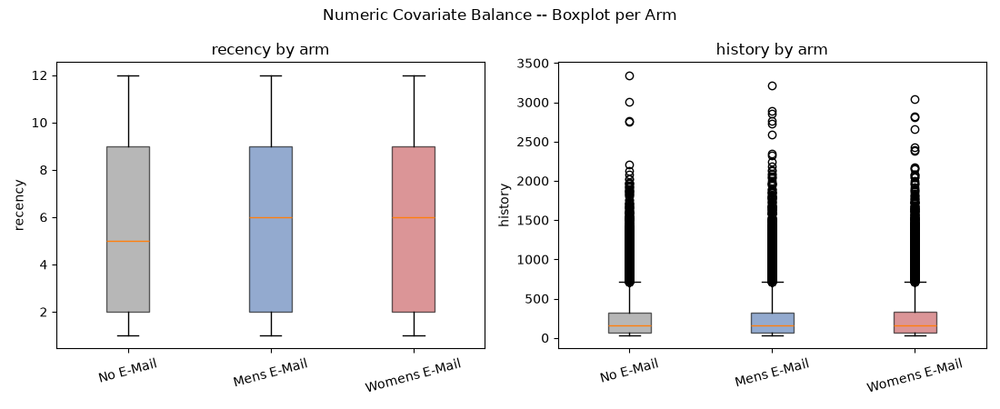
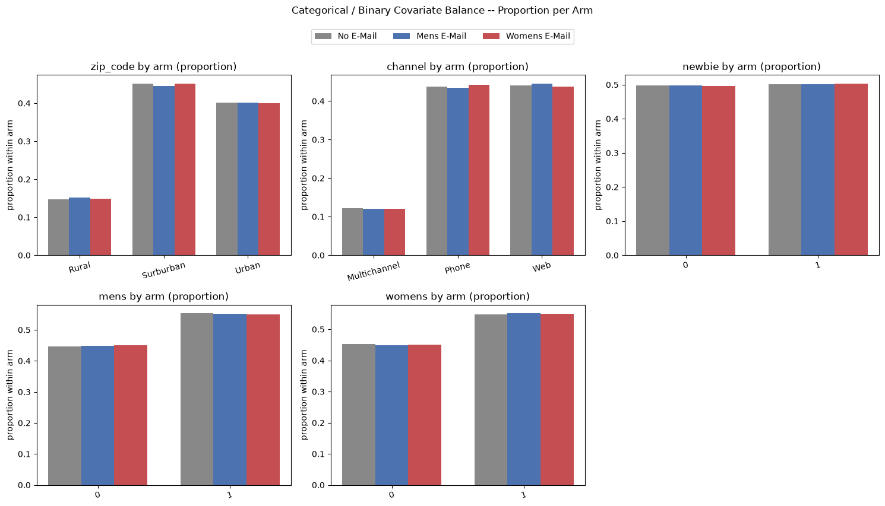

# Covariate Balance Report

**Dataset:** \
Hillstrom MineThatData Email Dataset: `data/hillstrom_email_data.csv`, 64,000 rows)

**Treatment (`segment`):**\
Mens Email, Womens Email, No Email (control)

**Purpose:**\
Verify that treatment randomization is actually balanced across covariate distributions, across all three arms, before proceeding to modeling with the X-Learner.

---

## Method

- **Numeric covariates** (`recency`, `history`):\
One-way ANOVA across all three arms runs first. Pairwise post-hoc tests (Mens vs. Control, Womens vs. Control) through Tukey HSD only follow if that ANOVA is significant.

- **Categorical / binary covariates** (`zip_code`, `channel`, `newbie`, `mens`, `womens`): \
chi-square test across all three arms at once.

- **Standardized Mean Difference (SMD):** \
computed pairwise, each treatment arm vs. control, per feature (numeric) or per category level (categorical/binary, each level treated as a 0/1 indicator). Flagged at `|SMD| >= 0.1`.

---

## Numeric Covariates: ANOVA Results

| Feature | ANOVA F | ANOVA p | Significant (α=0.05) | Post-hoc |
|---|---|---|---|---|
| `recency` | 0.270 | 0.7631 | No | Skipped, ANOVA not significant |
| `history` | 0.359 | 0.6980 | No | Skipped, ANOVA not significant |

---

## Categorical: Binary Covariates: Chi-Square Results

| Feature | χ² | p | dof | Significant (α=0.05) |
|---|---|---|---|---|
| `zip_code` | 2.872 | 0.5795 | 4 | No |
| `channel` | 3.632 | 0.4580 | 4 | No |
| `newbie` | 0.137 | 0.9339 | 2 | No |
| `mens` | 0.796 | 0.6717 | 2 | No |
| `womens` | 0.633 | 0.7289 | 2 | No |

---

## SMD Table: All Seven Covariates

SMD computed pairwise vs. control (No Email). Flag threshold: `|SMD| >= 0.1`.

<table>
<tr>
<th>Mens Email</th>
<th>Womens Email</th>
</tr>
<tr>
<td>

| Feature | SMD | Flagged |
|---|---|---|
| `recency` | +0.0068 | No |
| `history` | +0.0076 | No |
| `zip_code=Rural` | +0.0137 | No |
| `zip_code=Surburban` | -0.0117 | No |
| `zip_code=Urban` | +0.0020 | No |
| `channel=Multichannel` | -0.0042 | No |
| `channel=Phone` | -0.0083 | No |
| `channel=Web` | +0.0110 | No |
| `newbie=0` | +0.0009 | No |
| `newbie=1` | -0.0009 | No |
| `mens=0` | +0.0046 | No |
| `mens=1` | -0.0046 | No |
| `womens=0` | -0.0076 | No |
| `womens=1` | +0.0076 | No |

</td>
<td>

| Feature | SMD | Flagged |
|---|---|---|
| `recency` | +0.0052 | No |
| `history` | +0.0065 | No |
| `zip_code=Rural` | +0.0040 | No |
| `zip_code=Surburban` | -0.0011 | No |
| `zip_code=Urban` | -0.0018 | No |
| `channel=Multichannel` | -0.0053 | No |
| `channel=Phone` | +0.0086 | No |
| `channel=Web` | -0.0051 | No |
| `newbie=0` | -0.0026 | No |
| `newbie=1` | +0.0026 | No |
| `mens=0` | +0.0086 | No |
| `mens=1` | -0.0086 | No |
| `womens=0` | -0.0049 | No |
| `womens=1` | +0.0049 | No |

</td>
</tr>
</table>

---

## Figures

**Numeric covariates by arm (boxplot):**

**Categorical/binary covariates by arm (within-arm proportion):**

---

## Conclusion

The three-arm randomization looks clean. Every ANOVA (2 numeric features), every chi-square test (5 categorical/binary features), and every SMD (28 feature/arm/level combinations) across Mens Email, Womens Email, and No Email came back non-significant or near-zero, with every result well below the flag threshold. There is no evidence of a randomization bug or a covariate imbalance that would require stratification or reweighting before modeling.

**Verdict: proceed to modeling with the X-Learner.**